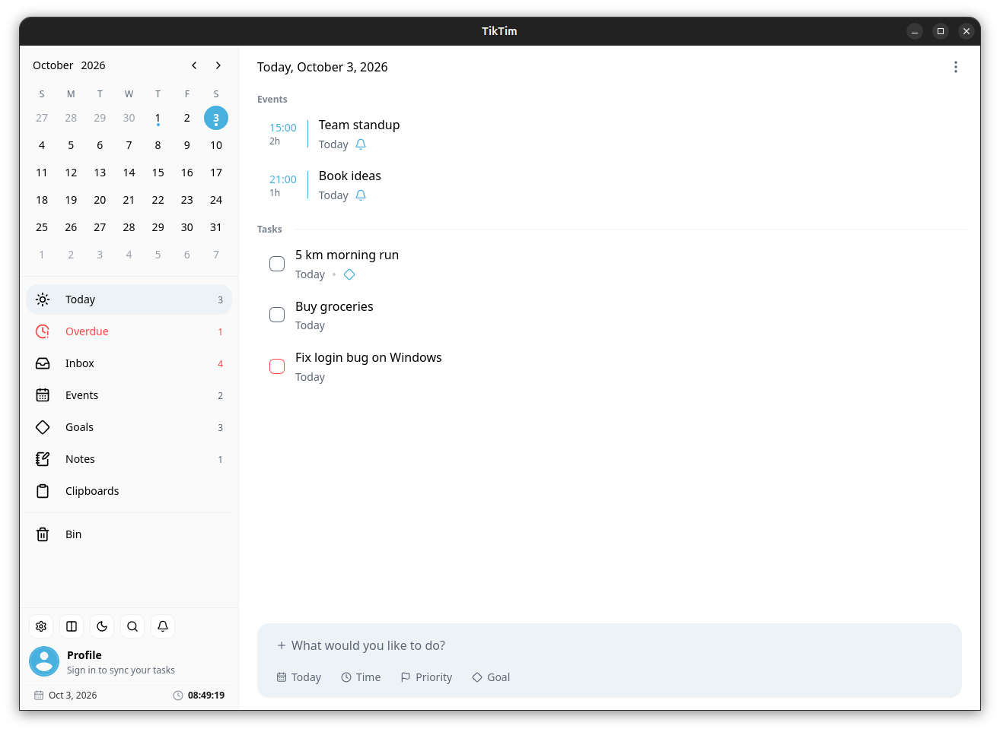
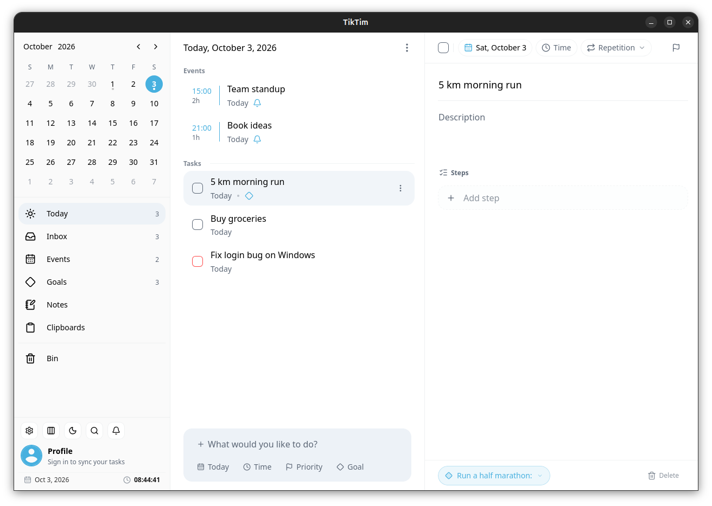
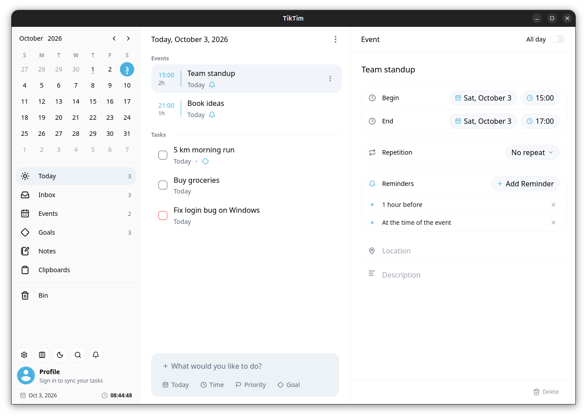
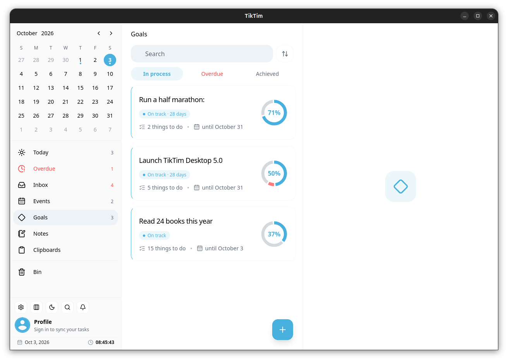
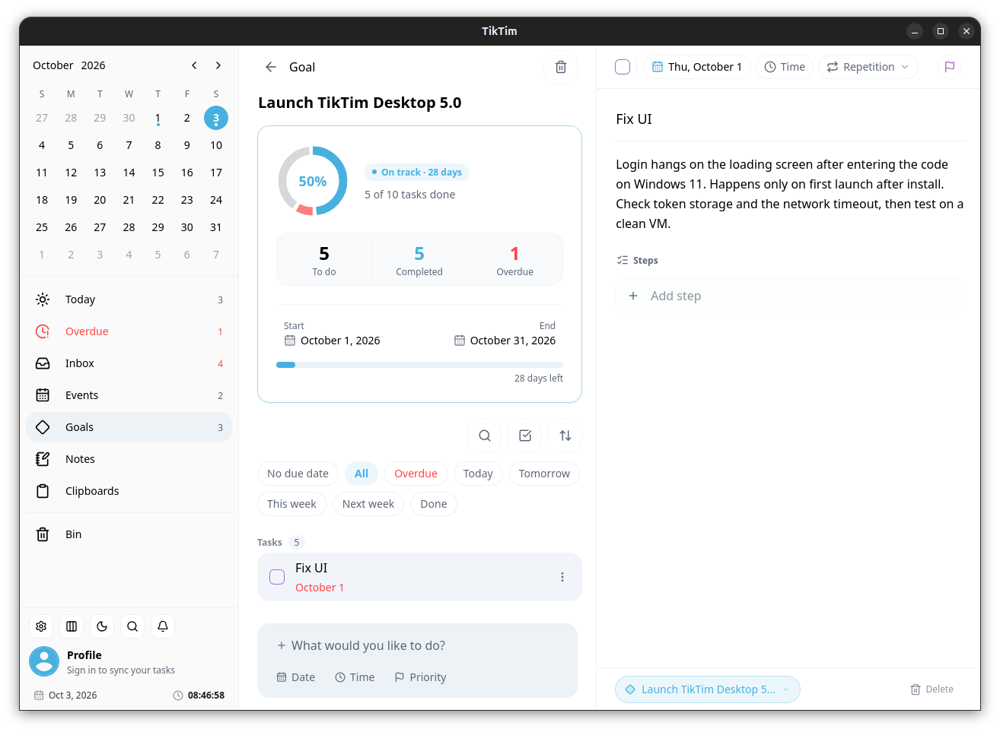
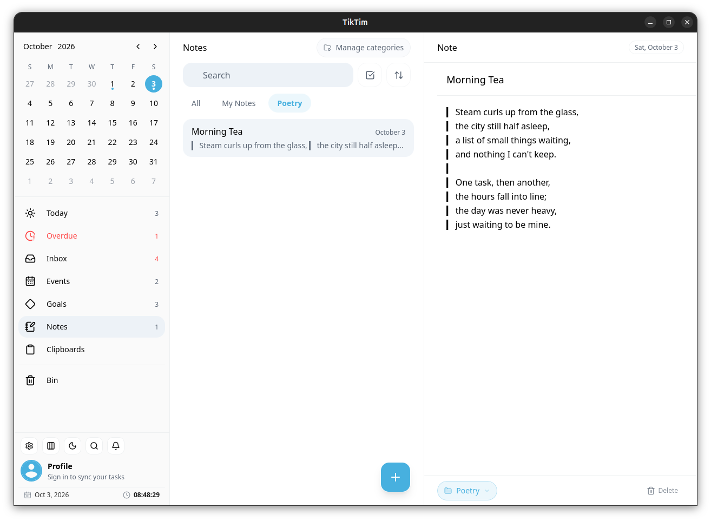
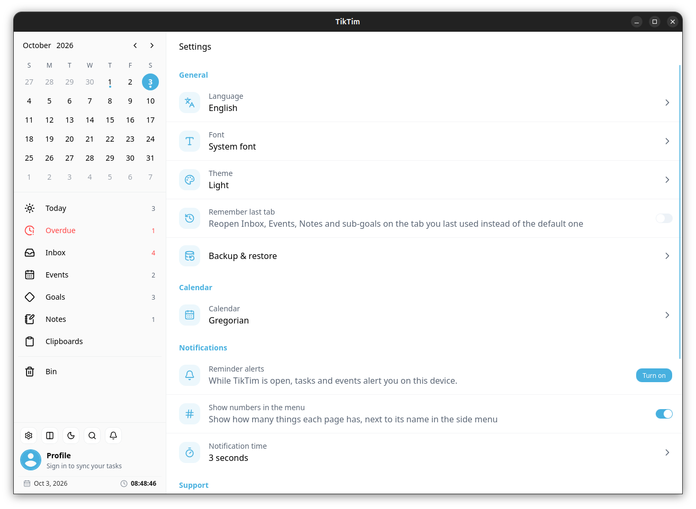
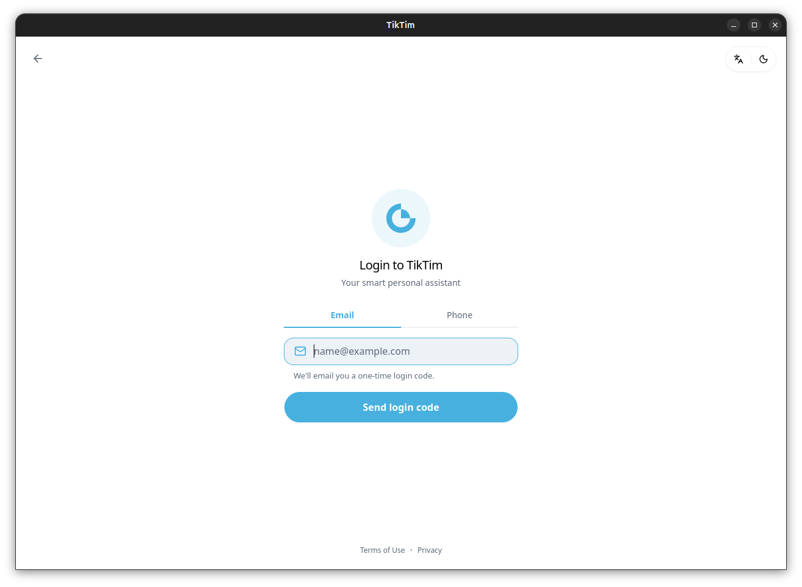

# TikTim for Desktop

### Your personal smart assistant, on Linux and Windows

TikTim is a simple, effective app that helps you plan and carry out the activities and events that matter, calmly and in order. Set deadlines for your goals, manage your time without the stress, and get the most out of every day.

Have an idea in mind? A goal to reach? Something to finish? Even just a shopping list? TikTim keeps it all in one place.

**[⬇ Download the latest version](https://github.com/manoujaf/tiktim-desktop/releases/latest)**

---

## Easy to use

A clean, light interface with no clutter. Capture your activities and events in seconds and get back to what you were doing.



## Quick activity capture

A call to make, a message to send, an email to check, or anything else, big or small. Add activities in seconds, set reminders, and use priorities to tackle the important ones first. Break bigger ones into steps and add a description when you need one.



## Effective event management

Doctor's appointments, meetings, catch-ups: events have a start, an end, and usually a place. With multiple reminders and repetition for each event, you'll never miss one again.



## Short-term and long-term goals

Anything with a timeframe and a set of activities behind it is a goal: a work or personal project, a course, a habit you want to change. Add your goals to TikTim, track your progress, and stay on course.

<p>
  
  
</p>

## Inbox for uncategorized tasks

Sometimes you just need to write something down so it doesn't slip away, and plan it later. An interesting idea, an urgent task, a quick reminder: all in one list, ready to be organized.

## Notes

Jot down ideas, short texts, or anything on your mind, and organize them into categories with a click.



## Priorities and reminders

Success is doing the right thing at the right time. TikTim helps you prioritize quickly, so nothing important reaches you late.

## Make it yours

English or Persian, Gregorian or Jalali calendar, light or dark theme, and the font you like.



## One account, everywhere

Sign in with your email or phone number and your tasks, goals, events and notes sync between the desktop app, the web app and the Android app.



---

## Download

Get the latest version from **[Releases](https://github.com/manoujaf/tiktim-desktop/releases/latest)**:

| System                    | File                         |
| ------------------------- | ---------------------------- |
| Windows 10 / 11           | `TikTim_x.y.z_x64-setup.exe` |
| Ubuntu / Debian / Mint    | `TikTim_x.y.z_amd64.deb`     |
| Fedora / openSUSE / RHEL  | `TikTim-x.y.z-1.x86_64.rpm`  |

Once installed, TikTim updates itself.

### Install on Linux

```bash
sudo apt install ./TikTim_*_amd64.deb      # Ubuntu / Debian
sudo dnf install ./TikTim-*.x86_64.rpm     # Fedora
```

## Also on

- Website: [tiktim.com](https://tiktim.com)
- Web app: [app.tiktim.com](https://app.tiktim.com)
- Android: TikTim

---

**Install TikTim and take back your day.**
